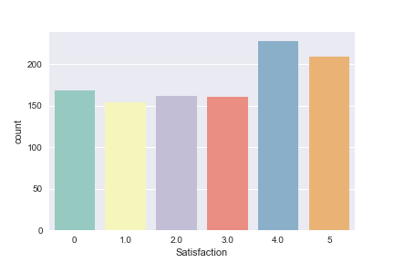
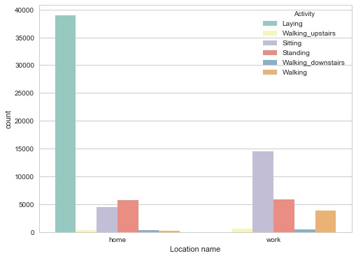
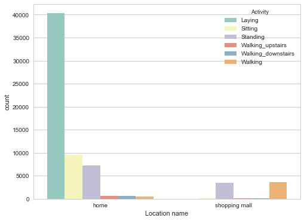
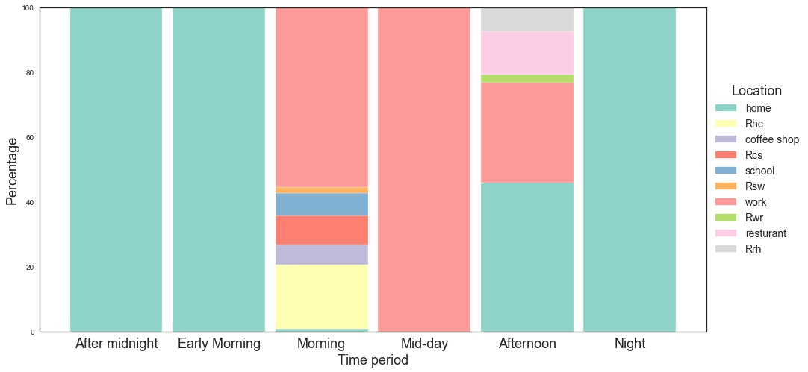
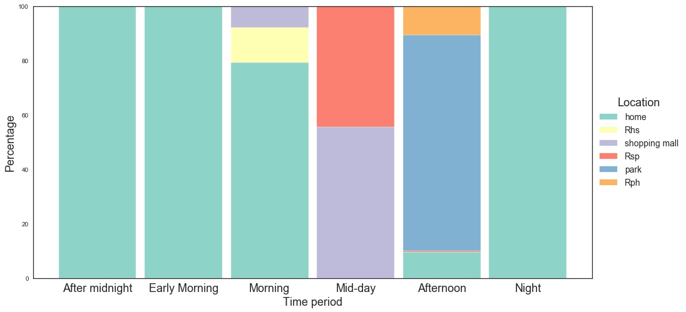

# A Synthetic User Behavior Dataset Design for Data-driven AI-based Personalized Wireless Networks

<a href="https://www.league.co.za/media/1896/digital-marketing.jpg"></a>

<!-- [](http://fvcproductions.com) -->


> It is envisioned that wireless networks of the future will support personalized, fine-grained services and decisions by predicting user satisfaction in real-time using machine learning and big data analytics. Data-driven personalization will empower wireless networks to further optimize resources while maintaining user expectations of networks. 

> In order to design, test, and validate research ideas related to wireless network personalization, we designed a synthetic user behavior datasets for four distinct personas. The datasets are designed to mimic the real characteristics of real datasets. 

> More details on the datasets and user satisfaction design can be found in the following published papers: 
* [1] R. Alkurd, I. Abualhaol, and H. Yanikomeroglu, “Dataset modeling for data-driven AI-based personalized wireless networks,” in Proc. 2019 IEEE International Conference on Communications (ICC), Shanghai, China, May 2019.
* [2] R. Alkurd, I. Abualhaol, and H. Yanikomeroglu, “A Synthetic User Behavior Dataset Design for Data-driven AI-based Personalized Wireless Networks,” ICC Workshops, Shanghai, China, May 2019.

---
## User Satisfaction Model


The dataset generation model is based on the user satisfaction model shown below.  For more details, checkout the references listed at the end of this guide.

 


---
## Data Generation Process

> One of the main design requirements of synthetic datasets
is that they need to be similar to real-world data. In order to create user behaviour dataset with realistic charactristics, we develop and used the concept of Tree Data Generartors (TG). 

> Here is an example of a TG for the working profeesional persoan. 


---
## Data 

> The Datasets included in this repo represets four users personas. The Datatsets can be downloaded from the following link: 

- Working Professional (WP)
  * Part one: https://drive.google.com/open?id=1ZsoudRUhkmvOxs4mT9otR89e9wKIaj9_
  * Part two: https://drive.google.com/open?id=1lJenUmksdfDKM8GX7rv1YIAcnAZorv_E
  * Part three: https://drive.google.com/open?id=1UcpXJOd5MWsWSueB-fAW8DToArDWtqaA
  * Part four: https://drive.google.com/open?id=1RwguhiPqgwrjvgXcNwrT8OhQjhUsWHl7 
  * Part five:https://drive.google.com/open?id=1b7XlEsNXKfZGhwQJCZG-9DgTo3MM9Bnt 
  * Part six: https://drive.google.com/open?id=1kc5guHnzulRnLYandAZm3t8Enty2lwMc
  
- University student (US)
  * Part one: https://drive.google.com/open?id=1xpv8p3wQS_KzL_H4f8q6IhiwiOKlaq78
  * Part two: https://drive.google.com/open?id=188_SbIt0bp3NmawDOxrIoO67R6spcLRR
  * Part three: https://drive.google.com/open?id=1g1JJMyLDIEkJaBxwVSCPqJtf-F0Nu3fq
  * Part four: https://drive.google.com/open?id=17m0YtYIc5ZdKdmK9IPT2W3auhxGpaxrs
  * Part five: https://drive.google.com/open?id=1PVTIRLEcSLCUjW9KCmfB5AAXHkF-onp5
  * Part six: https://drive.google.com/open?id=1G8a9IgM2ykJnZQG3rGbgClmx3tHtbsua
  
- High School Student (HSS) : 
  * Part one: https://drive.google.com/file/d/17-LZeIHArjJGKVSOLqOr0pxcjMwyf4fi/view?usp=sharing
  * Part two: https://drive.google.com/open?id=1knTtGTIjx64UXjHNdzwnJ8H4CtYsEk84  
  * Part three: https://drive.google.com/open?id=1XEfrQg7oT3FzHvFszrIgbIlIPmcZjQup 
  * Part four: https://drive.google.com/file/d/1cZusUhgzSRmwVgu-Y6sqIp2_nRegYn1N/view?usp=sharing
  * Part five: https://drive.google.com/open?id=13QNN0Lfg_Twt1gUARn3Eqs0QT0FoCwmN 
  * Part six: https://drive.google.com/open?id=1Y6CVcmioPPzGTAgKewT2svhyJlvBH1tc 

- Homemaker (HM): 
 * Part one: https://drive.google.com/file/d/1PBIuS2xrW-iR9S5QzQRrdztZrQNHbNRf/view?usp=sharing 
 * Part two: https://drive.google.com/open?id=10XtE4P5pFiJ63gixym3bcX_UnIPmi83q
 * Part three: https://drive.google.com/open?id=1WCEcaunEHQrqegKddkJ8RXPwdyi64IMU
 * Part four: https://drive.google.com/open?id=1kjDFZ2y932lS-UJOFOMAZjkYkYvZMzAt
 * Part five: https://drive.google.com/open?id=1bKD80GORsTUOYYNWgaM7S756gsvumH_H 
 * Part six: https://drive.google.com/open?id=1gy-ElNcogqyud_3oY42pI4wtApyzeUjX


> Each dataset is generated for a one year period. 

> Data for each persona is split into 6 folders.  Each folder contains data generated for two months. 

> Data for each month is split into 3 csv files. 

> Each csv file is named as: 
- Persona Name+month+Part number, 
where Persona Name={WP,HSS,US,HM}, Part number ={one, two, three} and month= {1,2,3,4,5,6,7,8,9,10,11,12}.


# Getting Started

### Extract Data 🔨🔨🔨

> Datasets folders are compresed to reduce size. You need to extract all files before reading the CSVs.


### Read data 

Datasets are stored in multiple csv. The following example illustrates how to read the WP persona dataset in one dataframe: 

```python

import pandas as pd

df_WP=pd.DataFrame()
for mon in range(1,12):
    for part in ['one','two','three']:
        path='WP'+str(mon)+part+'.csv'
        df=pd.read_csv(path, sep=',')
        df_WP=df_WP.append(df)
    
```


### Understanding the dataset


> Each dataset has a set of features (or context variables) and two labels , Satisfaction and satisfaction with noisy lambda.


---

# Datasets visualization

> In this section, In order to understand the correlation and data structure generated by the TG generator, we visiulize some of the dataswet features.

> The following figures are generated using notebook WP-Visualization.ipynb included in this repo.

### User Satisfaction Histogram



### User Satisfaction vs. Histogram
> In order to visualize the correlation between user satisfaction behavior and time period, we plot the user satisfaction histogram vs. time period. 


### User Activity Histogram 

> In order to visualize the correlation between location, days, and  activity, we plot the histogram of the recorded instances on a weekday and a weekend day for the six activities at two locations.


* Weekday



* Weekend



### Heatmap

> Here we visualize the correlation between the dataset context features through a heatmap.


 

###  User location vs. Time period Percentage Plot
> Here, to visually see the relationship between time period and location for WP persona, we plot the percentage of time the user spent at each location over each time period on a weekday and a weekend day.

* Weekday



* Weekend




